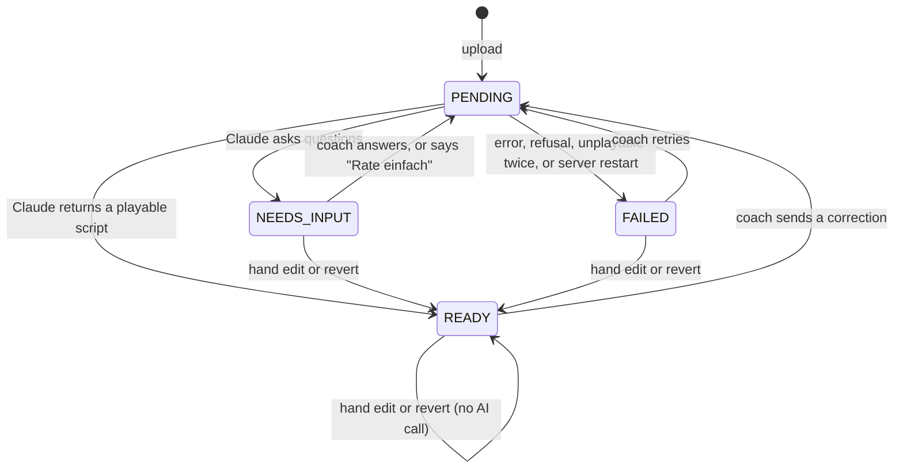
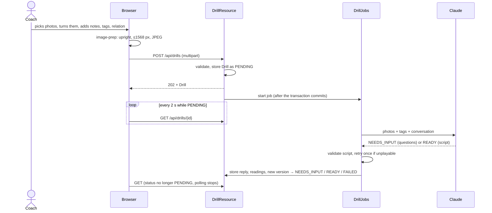

# How Drills work

A coach draws a drill on the tactic board, photographs it, and uploads the photos. Claude reads the
photos and answers with either Clarifying questions or a **Drill script**: a document describing who
stands where and who runs, passes and shoots when. The browser turns that script into a looping
animation on a small-court rink. The coach corrects the result by answering questions, by chatting
with Claude, or by editing the script by hand. Every change is kept as a new version.

This page explains how the pieces fit together. The decisions behind them are in
[ADR-0018](../adr/0018-drills-animated-from-tactic-board-photos.md) (the Drill, the script, the
animation) and [ADR-0019](../adr/0019-claude-interprets-drill-sketches.md) (Claude). The behaviour
is specified in [drills.feature](../spec/drills.feature), and the vocabulary (Stage, Actor, Part,
Step, Repetition) in [CONTEXT.md](../../CONTEXT.md).

1. [The flow](#1-the-flow): from photo to animation, and every way back in
2. [The AI interaction](#2-the-ai-interaction): what Claude sees, what it answers, and what happens when it's wrong
3. [The script](#3-the-script): the document in the middle
4. [The animation](#4-the-animation): from script to moving figures
5. [Where things live](#5-where-things-live)

---

## 1. The flow

### Status

A Drill is always in one of four states. Only one job runs per Drill at a time.



While a Drill is `PENDING`, every other change (answer, chat, retry, hand edit, revert) is refused
with **409 `drill_busy`**. Renaming, retagging and deleting still work.

### Step by step



**1. Upload (`/uebungen/neu`).** The coach adds 1–12 photos in order. Each photo can be turned a
quarter turn at a time and given a note ("Start", "Steigerung"). The coach also picks tags from the
fixed list and says how the photos relate: *progression* (each photo is a harder variant, so each
becomes its own Stage), *continuous* (the photos are phases of the same run), or *mixed*. A legend
on the page shows the drawing conventions Claude expects.

Before uploading, the browser prepares every photo (`image-prep.ts`):

- It applies the phone's EXIF rotation. Phones store portrait photos as landscape pixels plus a
  "rotate me" flag, and Claude misreads arrows and numbers on sideways photos.
- It applies the coach's own quarter turns on top.
- It shrinks the photo to at most 1568 px on the long edge (Claude doesn't see finer detail than
  that anyway) and encodes it as JPEG.

The server checks the name, that every file is really a JPEG (by its first bytes) of at most 3 MB,
the photo count, and that every tag exists. It stores the Drill as `PENDING` and answers **202**.
The job starts only once that transaction has committed, so it always finds the Drill in the
database.

**2. The job runs** (`DrillJobs`, two worker threads). It loads the Drill and its conversation in a
short transaction, calls Claude without holding a transaction open (a call takes one to three
minutes), checks the answer, and stores the result in a second short transaction. See
[section 2](#2-the-ai-interaction) for what happens inside.

**3. The drill screen (`/uebungen/:id`)** polls `GET /api/drills/{id}` every two seconds while the
Drill is `PENDING`, then shows what came back:

- **`NEEDS_INPUT`**: Claude's questions (*Rückfragen*), at most five. Each question can offer
  suggested answers, and hovering one highlights the symbols it's about on the matching photo. The
  coach answers some or all of them and sends, or presses **Rate einfach** to let Claude decide
  everything that's still open.
- **`READY`**: the animation, with one tab per Stage, and the list of assumptions Claude made.
- **`FAILED`**: the reason, in German, and a **Erneut versuchen** button.

Next to the animation are the photos. Under each photo, **Erkanntes anzeigen** shows what Claude
read on it (every symbol, placed on a rink), so a coach can see where a misreading came from.

**4. Correcting.** There are four ways to change a Drill. The two that call Claude are Coach-only;
the two that don't are open to every team member, Player included (ADR-0020). Photos can also be
added, removed and restored (never calling Claude), and a Drill can be drawn from scratch in the
animator with no photos at all: `/uebungen/neu/zeichnen`, built for a phone.

| Action | Calls Claude? | What it stores |
| --- | --- | --- |
| Answer questions / *Rate einfach* | yes | a coach message with the answers, then Claude's reply |
| Chat correction ("Die Hütchen stehen weiter links") | yes | a coach message, then Claude's reply: a new version, or questions back |
| Edit by hand (*Von Hand bearbeiten*) | no | a new version with source `EDIT`, if the server's validator accepts it |
| Revert / *Rückgängig* | no | a new version with source `REVERT`, a copy of the chosen one |

Versions are never overwritten. Reverting to version 1 from version 3 creates version 4, so the full
history stays available.

**5. Restarts.** Jobs live in memory. On startup, any Drill still `PENDING` belonged to a job that
died with the old process, so it is set to `FAILED` with "Abgebrochen, weil der Server neu gestartet
wurde". The coach retries.

---

## 2. The AI interaction

### One interface, one conversation

`DrillInterpreter.interpret(input)` is the only entry point. Its input is the Drill's name, the
photos with their notes, the tags, the photo relation, and **the conversation so far**. An upload,
an answer, a chat correction and a retry all go through the same call; they differ only in how
long the conversation is.

- `AnthropicDrillInterpreter` is the real implementation. It is used when `ANTHROPIC_API_KEY` is set
  (in dev: `backend/.env`).
- Without a key, the app uses an interpreter that fails every job with "Kein Anthropic-API-Key
  konfiguriert". The rest of the app works normally.
- In tests, `StubDrillInterpreter` answers however the scenario's `Given` steps tell it to, so
  `drills.feature` runs without network access and without cost.

### What Claude receives

Each request is rebuilt from the database, from scratch, in the same order every time:

1. **System prompt**: [`system-prompt.md`](../../backend/src/main/resources/drill/system-prompt.md)
   (the board, the rink coordinates, the drawing conventions, when to ask and when to assume, the
   script rules), followed by the JSON schema of the answer
   ([`interpretation.schema.json`](../../backend/src/main/resources/drill/interpretation.schema.json)).
   *Cached.*
2. **First coach turn**: for each photo, a caption ("Foto 2 — Notiz: Steigerung") and the image.
   *Cached up to the last photo.* Then the name, tags, relation and "Lies die Fotos und erstelle das
   Skript, oder stelle Rückfragen."
3. **The conversation**, alternating coach and Claude:
   - A **coach turn** is the chat text, or the answers formatted as "Antworten auf deine Rückfragen:"
     plus JSON pairs of question and answer.
   - A **Claude turn** is its earlier answer, rebuilt from what was stored: status, message,
     questions, and the script of the version it produced. The rebuild is deterministic, so the
     request's start stays the same from turn to turn and keeps hitting the cache.
   - If the coach **edited or reverted by hand** since Claude last saw the script, the next coach
     turn starts with "Ich habe das Skript von Hand geändert. Aktuelle Version: …", so Claude
     builds on the coach's version instead of its own.
   - Two coach turns in a row (e.g. a chat message after a failed job) are merged into one, because
     the API requires alternating roles.

Because the system prompt and photos are cached, a chat correction on a Drill with twelve photos
mostly pays for cache reads, not for the photos again.

**Model settings:** `claude-opus-5` (`spongecoach.anthropic.model`), adaptive thinking, effort
`high`, up to 64 000 output tokens, streamed so long answers don't hit HTTP timeouts, and
server-side fallback to the recommended model if a request is declined.

### What Claude answers

One JSON object (`Interpretation`), in two parts that Claude works through in order:

1. **Readings.** Claude first reads each photo on its own: which side of the board it shows, how
   it's rotated, and every symbol with its kind (cross, circle, run line, pass line, number, …),
   colour, position in rink metres, confidence and meaning. These are stored on the photo and shown
   under *Erkanntes anzeigen*.
2. **Result.** Then it builds on those readings and answers one of:
   - `NEEDS_INPUT` with up to five **questions**, most important first. Each can offer `options` and
     points at the photo and `symbolIds` it's about (that's what the hover highlight uses).
   - `READY` with a **script** and a `changeSummary` (what changed since the previous version).

Both carry a short `message` to the coach in German, shown in the conversation.

### Ask, don't guess

The prompt draws a firm line, because a confident wrong animation is worse than a question:

- **Claude must ask about**: what an ambiguous symbol is (defender or cone?), which side an Actor is
  on when nothing shows it, progression versus continuation, which Actor is which across photos,
  step order when neither numbers nor the ball settle it, drawings that contradict themselves, and
  game situations (asked with a concrete proposal).
- **Claude may assume, and lists the assumption**: speeds, curve shapes, small timing gaps, movement
  inside a roam, pass direction when the ball settles it, the repetition when confident, and "no
  goalie drawn" meaning the goalie doesn't matter.
- **The ball decides most things.** Only whoever has the ball can pass it, so a missing arrowhead
  or an unnumbered sequence can often be worked out without asking.
- **Tags and notes are hints**, never facts. If the drawing contradicts a tag, Claude asks.
- **"Rate einfach"** tells Claude to stop asking, decide everything itself, and list each decision
  as an assumption.

These rules come from [examples/README.md](examples/README.md), where the coach confirmed them
against eight real drills.

### When the answer is wrong

There are two independent safety nets. Between them, one job makes at most four requests.

```
interpret()                              ← AnthropicDrillInterpreter
 ├─ call Claude
 ├─ refusal?          → FAILED "Claude hat die Anfrage abgelehnt."
 ├─ cut off?          → FAILED "Claudes Antwort war zu lang …"
 ├─ not JSON?         → ask once more: "Das war kein gültiges JSON …"
 │                      still not JSON → FAILED
 └─ Interpretation
check()                                  ← DrillJobs
 ├─ NEEDS_INPUT without questions, or a READY script the validator rejects?
 │     → call interpret() once more, appending Claude's answer and the list of problems:
 │       "Das Skript ist so nicht abspielbar: - … Bitte korrigiere diese Punkte."
 │     still wrong → FAILED "Claudes Skript war auch nach einer Korrektur ungültig: …"
 └─ store → NEEDS_INPUT or READY
```

These retry turns exist only for the duration of the job. They are not stored in the conversation.

The **validator** (`DrillScriptValidator`) checks what the JSON schema can't express, and returns
every problem at once so Claude can fix them all in its single retry:

- every id a Step, Part or pass refers to exists, and ids are unique;
- every position is on the rink (with 0.5 m of tolerance at the boards);
- speeds are above 0 and at most 40 m/s, and roams and waits have a duration;
- only passes have a target;
- steps don't wait for each other in a cycle;
- in a seamless loop, every Part is handed on to exactly one other Part;
- an Actor keeps its kind and side across Stages;
- every photo reference exists.

The same validator checks hand edits, which are refused with **400** and the list of problems.

### Checking the prompt against real drills

`gradlew drillExamples` (or `-Pexample=bresil` for one) runs each folder in
[examples/](examples/) against the real API. It prepares the photos the way the browser does,
answers Claude's questions with the scripted coach answers from `expected.md`, and writes a report
to `backend/build/drill-examples` to compare against `expected.md`. It costs money (10–15 calls for
all eight), so it runs by hand when the prompt changes, and not in `test` or `verify.ps1`.

In dev, `DrillExampleSeeder` loads the examples as ready Drills from each folder's `animation.json`
(a saved answer from a real run), so there's something to watch without an API key.

---

## 3. The script

The script is the contract between Claude, the editor and the animation. It is one JSON document
(`DrillScript` in Java, `drill.model.ts` in TypeScript), stored whole in `drill_script_version`, one
row per version.

**Coordinates** are metres on the Swiss small court, 14 × 24 m, with the origin at the centre spot:

```
            y = +12  (end board)
      ┌───────────────────────┐
      │         [goal]        │  y = +9.65  goal line
      │                       │
      │                       │
 x=-7 │           ·           │ x=+7        y = 0  centre line
      │                       │
      │                       │
      │         [goal]        │  y = -9.65
      └───────────────────────┘
            y = -12
```

A half-rink Stage uses only `y ≥ 0`. The dimensions live in `Rink.java` and `rink.ts`; change both
together.

A Drill has one or more **Stages**. Each Stage is one continuous run and holds:

- **Actors**: figures with a kind (player, goalie, coach), a side (A, B, neutral), a label, a start
  position and whether they start with a ball. An Actor isn't a Team member. Its id stays the same
  across Stages.
- **Parts**: what an Actor does in one run ("Passgeber", "Kolonne hinten"). Steps belong to Parts,
  not Actors, which is what lets a seamless loop hand a Part to a different Actor next time round.
  `nextPartId` says which Part this Part's Actor plays in the next run.
- **Props**: cones, poles, small goals.
- **Steps**: `RUN`, `DRIBBLE`, `PASS`, `SHOT`, `ROAM` or `WAIT`. Each has a path, a speed or a
  duration, and a **relative start**: "after Step X reaches its `START` or `END`, plus `delay`
  seconds", or `DURING` X: `afterFraction` (0 to 1, exclusive) of the way through it, which is how a
  pass or shot happens while a runner is still running. A step without `after` starts with the run.
  Steps have no clock times, so changing one speed moves everything that depends on it. A Step
  whose `sketch` is 0 was drawn by hand, on no photo.
- **Repetition**: `REPLAY` or `SEAMLESS`, and optionally `mirrored`.
- The script also carries a list of **assumptions** in German.

Who has the ball is not part of the Step type. A `RUN` carries the ball if the Actor has it. A
`DRIBBLE` is active stickhandling, drawn with the ball swinging from side to side.

---

## 4. The animation

The animation runs entirely in the browser. It is split into two pure TypeScript modules, which are
unit-tested without a canvas, and two thin Angular components that draw and play the result.

```
Stage ──► drill-schedule.ts ──► RunSchedule ──► drill-sampler.ts ──► Frame ──► DrillRink (SVG)
          (times, paths, balls)  (one run)        (positions at t,       (actors,      ▲
                                                   the loop)              balls)        │
                                                                     RinkPlayer ────────┘
                                                                     (clock, controls)
```

### Scheduling one run (`drill-schedule.ts`)

`schedule(stage, cast, mirrored)` turns relative starts into absolute times. The **cast** says which
Actor plays which Part in this run. `mirrored` flips every point across the long axis (`x → −x`).

It resolves the steps in waves:

1. Take every step whose anchor is already resolved (or that has none).
2. Its start is the anchor's start or end, plus the delay.
3. Its length depends on **where its Actor is at that moment**, which comes from the movements
   already scheduled. That's why the order matters. Moving steps take `path length ÷ speed`; roams
   and waits take their `duration`. A zero speed or duration falls back to the defaults (run 4.5,
   dribble 3.5, pass 12, shot 25 m/s; 2 s).
4. `RUN`, `DRIBBLE`, `ROAM` and `WAIT` become **movements** of the Actor. `PASS` and `SHOT` become
   **flights** of the ball, starting at the passer's current position.

A cycle or a missing anchor doesn't crash the animation: the affected steps start with the run and
a warning is recorded. The server's validator should already have prevented both.

**Balls** are named after the Actor that starts with one. The scheduler follows each ball through
the flights in time order: when a flight starts, the ball leaves its holder; when it lands, the
pass target holds it, or it comes to rest (after a shot, or a pass with no target). A pass by
someone without a ball still shows a "stray" ball, so the coach sees what the script actually says.

**Worked example**, the first run of `langkurz` (a long pass across, a run to the middle, a return
pass):

| Step | Part | Anchor | Start | Distance ÷ speed | End |
| --- | --- | --- | --- | --- | --- |
| s1 `PASS` to p3 | Passgeber | none | 0.00 | 9.9 m ÷ 15 m/s | 0.66 |
| s2 `RUN` | Passgeber | s1 `START` + 0.2 | 0.20 | 4.3 m ÷ 4.5 m/s | 1.16 |
| s3 `PASS` to p2 | Station rechts | s2 `END` + 0.3 | 1.46 | 5.9 m ÷ 12 m/s | 1.95 |
| s4 `WAIT` | Kolonne hinten | none | 0.00 | 4 s | 4.00 |

The ball starts with the Passgeber, flies to Station rechts from 0 to 0.66 s, and flies back from
1.46 s to 1.95 s. The run lasts 4 s because of the wait.

### Sampling a moment (`drill-sampler.ts`)

`sampleRun(stage, run, t)` returns a **Frame**: every Actor's position and every ball's position at
time `t`.

- A **moving** Actor is interpolated along its path at constant speed.
- A **roaming** Actor goes out along its path and back, with an ease at each turning point, like
  someone shuffling side to side. The number of back-and-forths is chosen so they move at about
  2 m/s.
- A **carried** ball sits just beside its holder. During a dribble, it moves 0.4 m ahead of the
  player and swings ±0.35 m across the direction of travel, 2.5 times a second.
- A ball **in flight** moves along the pass or shot path.

### The loop (`Playback`)

A Stage's animation loops one run, according to its Repetition. `Playback` strings runs together
into one loop and works out how long it is.

- **`REPLAY`**: play the run, hold the last frame for 1 s, start again.
- **`SEAMLESS`**: play the run, then spend 1.5 s walking every Actor (with smooth easing) to where
  they start the next run, and hand the balls to the next run's starting holders. Before the next
  run, every Part is handed on: the Actor who played P now plays P's `nextPartId`. The next queue
  player steps up, the passer moves to the back, and so on.
- **`mirrored`**: every second run is played mirrored, from the other side of the rink.

The loop keeps adding runs until the cast is back where it started (and, when mirrored, the side
too). A rotation through five Parts therefore makes a loop of five runs. It stops at twelve runs.

`frameAt(t)` wraps `t` into the loop, finds the run it falls in, and samples it (or the hand-over).

### Drawing and playing

**`DrillRink`** draws a frame as SVG, in rink metres. The SVG's y axis points down, so the rink is
flipped to put the `+y` goal at the top. The Step paths of the current run are drawn faintly, the
way a coach draws them on the board: a solid line for a run, a zigzag for a dribble, a dashed line
for a pass, a double line for a shot, and a roam without an arrowhead. The same component draws
Claude's readings on the photos and the editor's drag handles.

**`RinkPlayer`** owns the clock. It advances time on every `requestAnimationFrame` (never more than
0.1 s per frame, so a hidden tab doesn't jump), and has controls for play and pause, scrubbing,
speed (0.5×, 1×, 2×) and **stepping to the next Step's start**. A new Stage starts from zero.

**`DrillEditor`** works on a copy of the script:

- drag Actor starts, waypoints and Props on the rink (snapped to 10 cm, kept on the rink);
- change a Step's type, anchor, edge, delay, speed or duration;
- delete a Step (anything that waited for it now waits for what it waited for);
- set the Repetition and each Part's next Part;
- see a timeline with one row per Part, computed with the same scheduler;
- undo (up to 50 steps) and preview with the real player.

Saving sends the whole script to `PUT /api/drills/{id}/script`. If the server's validator rejects
it, the editor stays open and shows the problems.

---

## 5. Where things live

| What | Where |
| --- | --- |
| Endpoints, busy check, answers, hand edit, revert | `backend/…/api/DrillResource.java` |
| Background jobs, validation retry, conversation replay, storing results | `backend/…/drill/DrillJobs.java` |
| The Claude call: request, caching, parsing, JSON retry | `backend/…/drill/AnthropicDrillInterpreter.java` |
| Prompt and answer schema | `backend/src/main/resources/drill/` |
| Script shape and checks | `DrillScript.java`, `DrillScriptValidator.java`, `Rink.java` |
| Tables | `V14__drill.sql`: `drill`, `drill_sketch`, `drill_script_version`, `drill_message`, `drill_tag` |
| Photo preparation | `frontend/…/drills/image-prep.ts` (browser), `SketchImages.java` (seeder, example test) |
| Scheduling and sampling | `frontend/…/drills/drill-schedule.ts`, `drill-sampler.ts`, `rink.ts` |
| Screens | `drill-list`, `drill-upload`, `drill-view`, `drill-questions`, `drill-chat`, `drill-editor` |
| Rink and player | `drill-rink/` (SVG, path styles), `rink-player/` |
| Real drills with confirmed answers | [examples/](examples/) |

### Known limits

- Jobs live in memory; a restart fails whatever was running.
- There is no cost limit yet. Every upload, answer, chat message and retry makes one to four Claude
  requests.
- The rink dimensions come from a summary of the swiss unihockey rules, not the rulebook itself.
- Drills aren't linked to Events or Focus yet, tags are a fixed list, and there's no video export.
